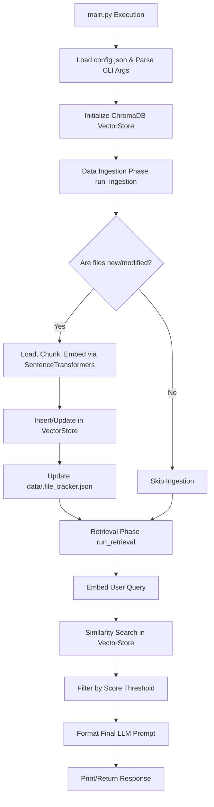

# Local RAG Pipeline: Detailed Program Flow & Documentation

This document provides a minute-by-minute detailed breakdown of the exact execution flow of the Retrieval-Augmented Generation (RAG) pipeline, along with concrete input and output examples.

## 1. High-Level Flow Diagram



---

## 2. Minute Detail Flow

### Step 1: Configuration & Initialization (`main.py`)
1. The script first attempts to read `config.json`, which contains default parameters for the application, vector database, document chunks, and retriever thresholds.
2. It initializes `argparse`, falling back to `config.json` defaults for the `--pdf_path` and `--query` arguments.
3. `main(pdf_path, query)` is invoked.
4. An instance of `VectorStore` is created. It connects to the local ChromaDB path (`data/vector_store`) and either fetches or creates the `PDFDocuments` collection.

### Step 2: Smart Data Ingestion (`Data_ingestion/load_data.py`)
1. The pipeline scans the designated folder (`data/`) for supported document types (`.txt`, `.pdf`, `.docx`).
2. **State Tracking Check**: It loads `data/.file_tracker.json`. For every file found in the directory, it compares the current operating system modification time (`mtime`) with the stored time in the tracker.
3. If no files have been modified or added, the ingestion pipeline safely skips loading and embedding to save compute time.
4. **Loading**: If new/modified files exist, it uses LangChain loaders (e.g., `PyMuPDFLoader`, `TextLoader`) to extract raw text and metadata.
5. **Text Splitting**: The loaded documents are passed to the `RecursiveCharacterTextSplitter`. Using the model's tokenizer to count tokens, it chunks the text (e.g., chunk size 1000, overlap 200). Empty chunks are filtered out.
6. **Embedding Generation**: For each chunk, the `sentence-transformers/all-MiniLM-L6-v2` model converts the text into a dense mathematical vector (384 dimensions).

### Step 3: Vector Database Storage (`Data_ingestion/Vector_db.py`)
1. The embeddings, document text, metadata, and generated unique IDs (e.g., `filename_chunk_0`) are passed to `VectorStore._add_data()`.
2. The database checks if any of these specific chunk IDs already exist in the database to prevent duplicate entries.
3. It inserts the new document chunks into the ChromaDB collection.
4. The `DataIngestionPipeline` then updates `data/.file_tracker.json` with the new modification timestamps of the processed files.

### Step 4: Semantic Retrieval (`Retriver/retrive.py`)
1. `RAGRtriever` takes the user's query and generates an embedding for it using the exact same SentenceTransformer model.
2. It queries the `VectorStore` to find the most semantically similar document chunks.
3. The query looks for the `top_k` results (e.g., 10) and then filters them to ensure they meet the minimum `score_threshold` (e.g., 0.2).

### Step 5: LLM Prompt Formatting
1. The filtered document chunks are passed to `format_prompt_for_llm()`.
2. The method wraps each document snippet securely inside XML-style boundaries (`<document index="1" source="..."> ... </document>`).
3. It assembles a highly structured system prompt. This prompt explicitly instructs the LLM to only use the provided context and mandates inline file citations.
4. The final prompt is returned by the script and printed to the terminal.

---

## 3. Input & Output Examples

### Example Input

**1. Data Files (`data/harrypotter.txt`):**
Imagine the `data` directory contains a small text file `harrypotter.txt` describing scenes from Harry Potter.

**2. Configuration (`config.json`):**
```json
{
  "app": {
    "pdf_path": "data",
    "query": "what did harry said to dumbledore"
  },
  "vector_db": {
    "collections_name": "PDFDocuments",
    "persistent_directory": "data/vector_store"
  },
  "retriever": {
    "top_k": 5,
    "score_threshold": 0.2
  },
  "ingestion": {
    "model_name": "all-MiniLM-L6-v2",
    "chunk_size": 1000,
    "chunk_overlap": 200
  }
}
```

**3. Execution Command:**
```bash
uv run main.py --query "what did harry said to dumbledore"
```

### Example Output

When the pipeline executes successfully, the output printed to the terminal is the fully constructed prompt string ready to be injected into a Large Language Model. 

```text
--- Results ---
Query: what did harry said to dumbledore
Response:
You are an expert analyst. Your task is to answer the user's question based strictly on the provided context.

        <instructions>
        1. Analyze the text within the <context> tags.
        2. Answer the question using ONLY the provided information. 
        3. If the answer is not present in the context, explicitly state: "I cannot find the answer in the provided documents." Do not use outside knowledge.
        4. Every time you state a fact, you MUST cite the source file inline using brackets. Example: "The magic bounced off him because of his giant blood [harrypotter.pdf]."
        </instructions>

        <context>
        <document index="1" source="harrypotter.txt">
        “Let me out,” Harry said yet again, in a voice that was cold and almost as
calm as Dumbledore’s.
“Not until I have had my say,” said Dumbledore.
“Do you — do you think I want to — do you think I give a — I DON’T
CARE WHAT YOU’VE GOT TO SAY!” Harry roared. “I don’t want to hear
anything you’ve got to say!”
        </document>

        <document index="2" source="harrypotter.txt">
        “There is, actually, sir,” said Harry. “It’s about Malfoy and Snape.”
“Professor Snape, Harry.”
“Yes, sir. I overheard them during Professor Slughorn’s party . . . well, I
followed them, actually. . . .”
        </document>
        </context>

        <question>
        what did harry said to dumbledore
        </question>

        Answer:
---------------
```

> **Note**: Currently, the application stops at constructing the prompt. The printed "Response" is the raw, optimized text that you would feed to an LLM (such as Llama-3, OpenAI GPT-4, or Google Gemini) to get the final natural language answer.
